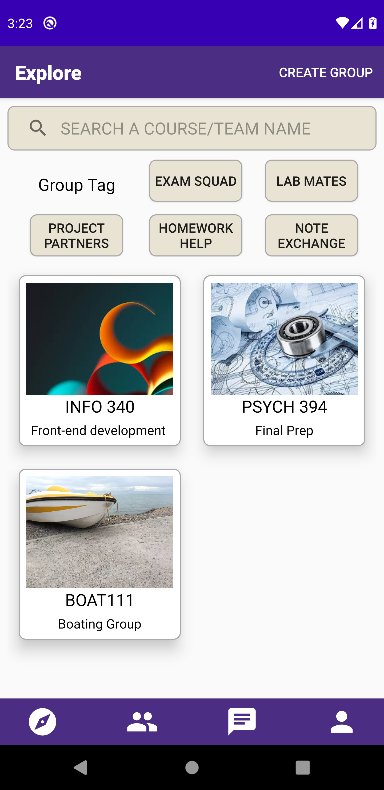
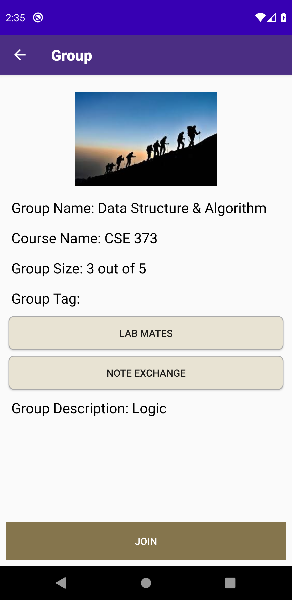
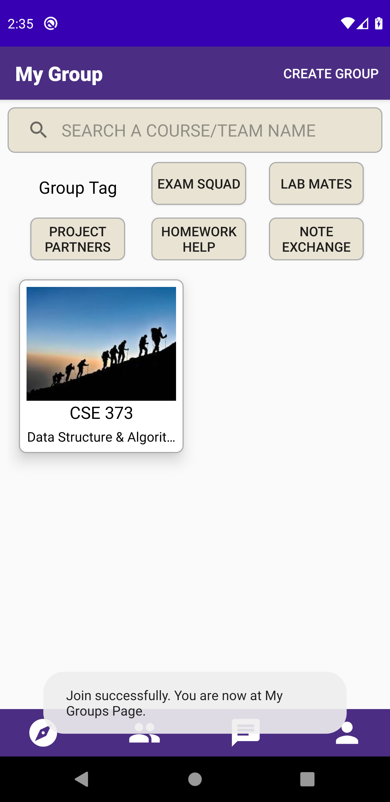
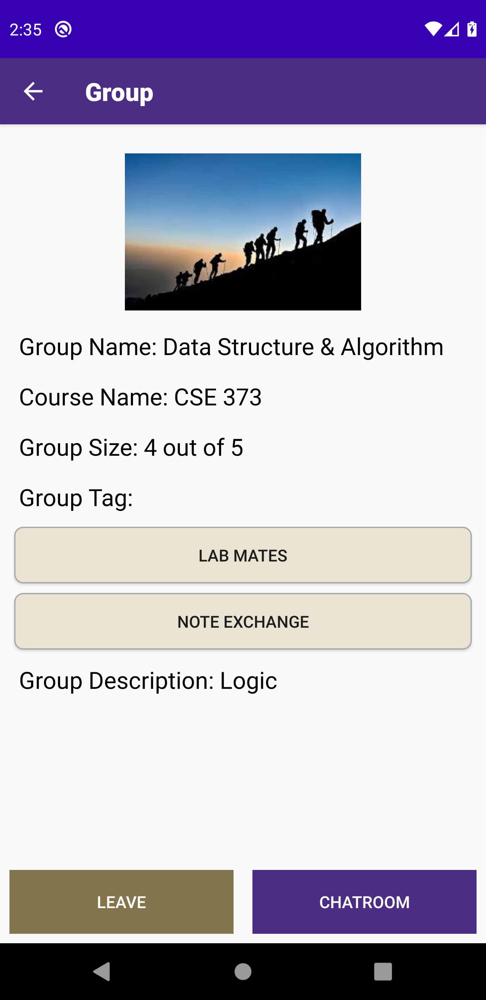
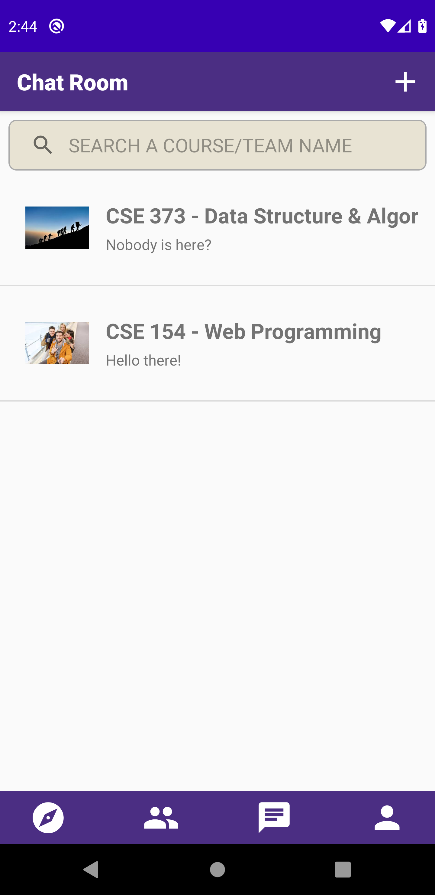
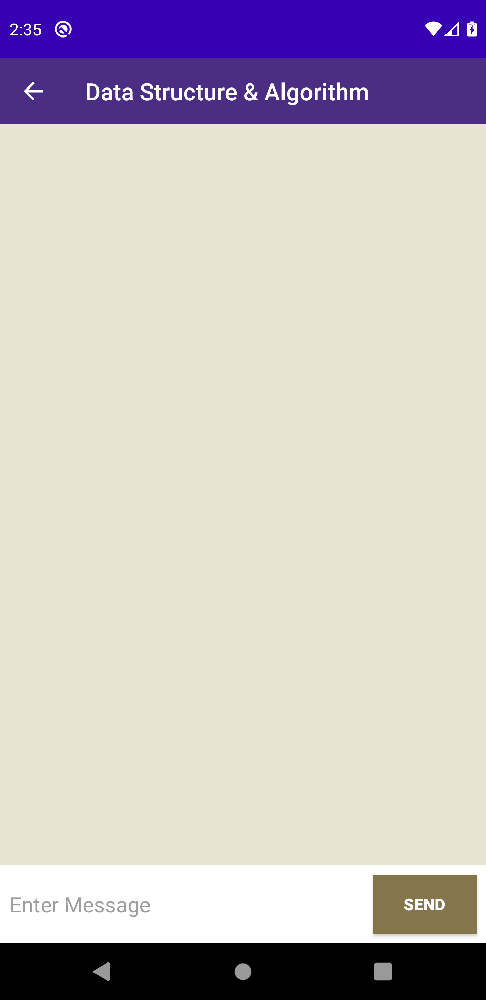
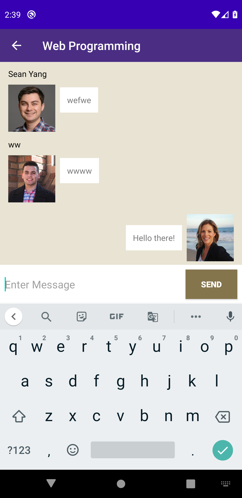
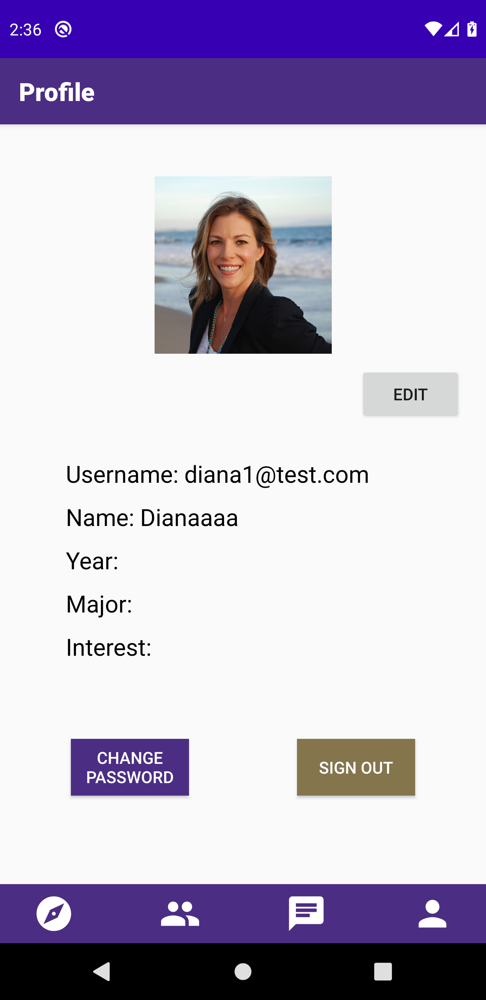
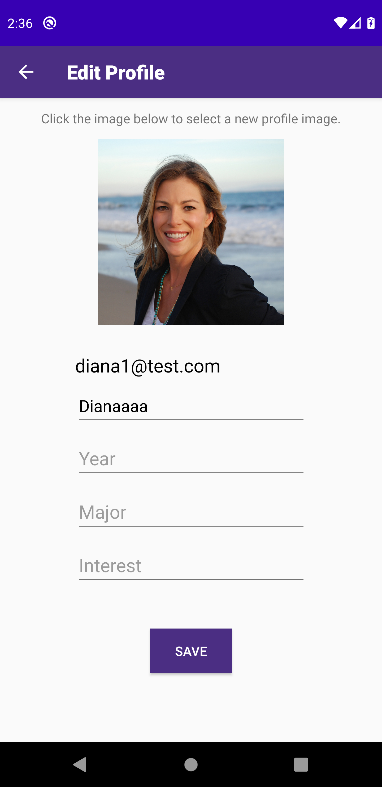

# VirtualStudyGroup
This is a Kotlin app aimed to be a tool for students to create and find virtual study group to study and chat. Some main functionalities of this app include: explore different groups, create/join/leave/disband a group, group chat and user profile setting.

## Developers
We are Team Lateinit: Eric Chen, Diana Dai, Wayne Li and Sean Yang.
We want to build a virtual study group app that benefits UW students.

## Why this App?
Since people are not encouraged to meet in person during the pandemic, Internet is a great place to go. And for students, we can study together online.  

## Core User Stories
- As a student who wants to form a group and starts a new project with my classmates, I want to be able to create a new group and introduce it to others so that I can manage the project more easily.	When I press the Create Group, I should be able to create a group with basic information.
- As a student who wants to join study groups, I want to find a group that meets my interests and needs quickly, and I want to join multiple groups to connect with more students and participate in more discussions. So there should be ways to filter out groups by courses, and join different groups that are for either exam preparation, lab and homework help, or project collaborations.
- As a student who takes a class alone, I am extremely nervous and want to find some study partner so that we can discuss about the course materials and I can also find some new friends. So I think there should be some kind of large public group associated with the class where each student in a class can join easily without some mandatory invitation or add code.
- As a teaching assistant, I want to quickly join a study group, so that I can resolve students’ confusion in the course material as soon as possible. When I fill in the group name or course number, I should quickly find the group and join in.

## Experience & Result
The virtual study group is now fully functioning with all the requested features implemented, including:
- Create/join/leave/disband a group
- Edit group information
- Chat within a joined group
- Edit user profile information
We have also added some bonus features, such as message notification.

## Emulator Preview
Onboard Screen

Explore Group Screen

Group Info Screen

My Group Screen

My Group Info Screen

Chat Room Screen

Empty Chat Screen

Group Chat Screen

Profile Screen

Profile Edit Screen

